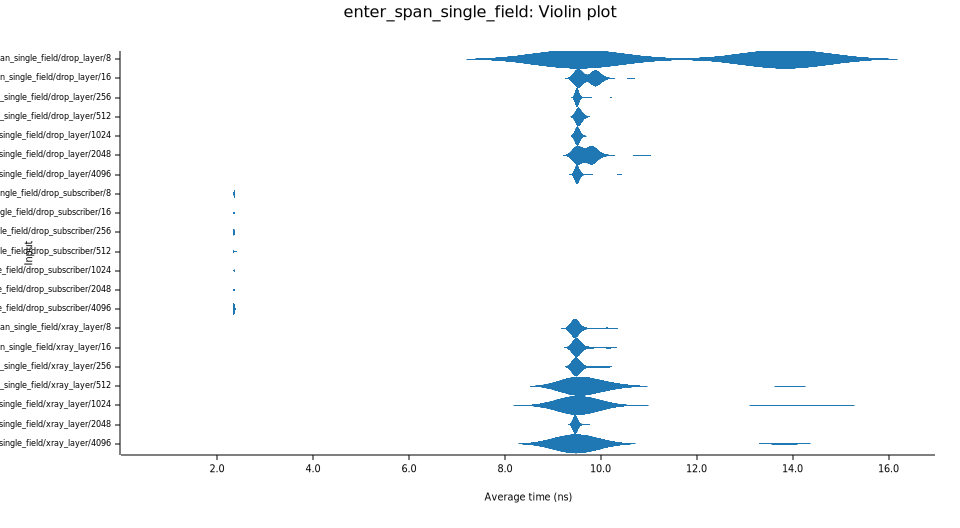
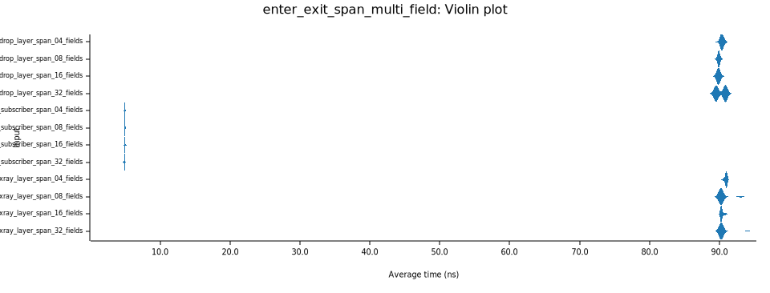

# tracing-benchmark-experiments

Benchmarking the `Subscriber` trait vs the `Layer` trait.

## Single Field
For the single field case, we test increasing string lengths for the field. The length of the string is incremented by powers of 2.

## Multifield
In the multifield case, the fields themselves are really small.

